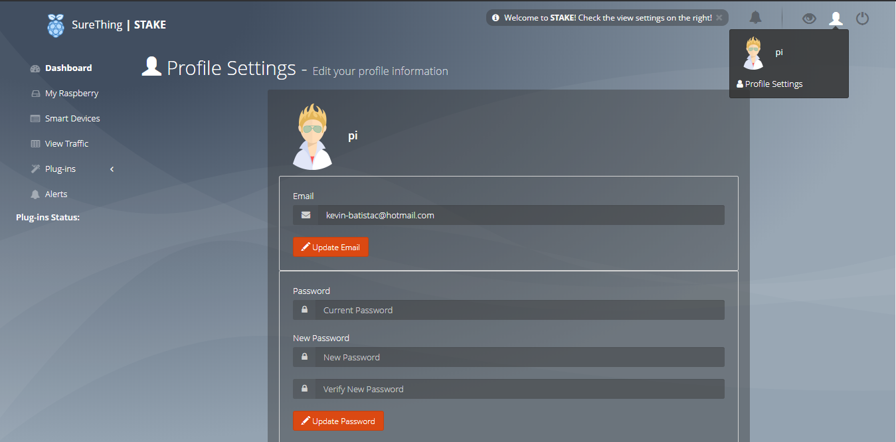
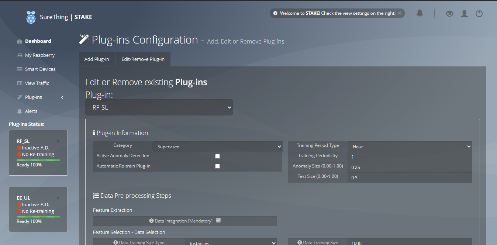
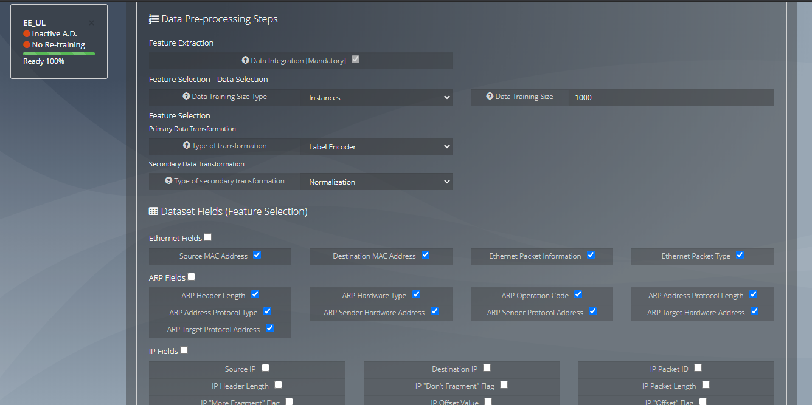

# STAKEPrototype
STAKE project code - Kevin B. Corrales - advisor Miguel L Pardal

## STAKE System Demo
The STAKE system is available via HTTP protocol. \
The Web interface allows users to access various functionalities and information from the Machine Learning plug-ins and network.
### Entry page:
The **Entry page** of the system allows the user is able to sign in or log in. \
The information needed to sign in are: Username, E-mail and Password. \
 \
The information needed to give to log in are: Username and Password. \


### Dashboard page:
After the user is authenticated, the user is redirected to the **Dashboard page**. \
This page displays a summary of information available from the following pages: **Captured Traffic page**, **System Information page**, **Device Management page**, **Alerts page** and **Plug-ins Results page**. \
 


### Profile Settings page:
The  **Profile Settings page** is available through the Web interface header. \
This page enables the user to edit his profile information. \


### Device Management page:
The **Device Management page** allows the user to manage the network devices. \
The auditing of alerts raised by an anomaly detection is important, since it enables the ability to investigate the anomaly. \
Thus, devices can be identified in this page by matching a name with the device MAC address. \
Additionally, the user is able to add a short description about the identified device. \


### Plug-in Configuration page:
The most compounded page is the **Plug-in Configuration page**. \
This page allows the user to add, edit and remove plug-ins. \
By adding or editing a plug-in the user can configure specific plug-ins information such as:
- Plug-in file path (".sav" extension is mandatory);
- Plug-in name;
- Identify the Plug-in category (Supervised/Unsupervised);
- Enable/Disable Plug-in anomaly detection;
- Enable/Disable automatic Plug-in re-training;
- Configure the re-training periodicity;
- Select the anomaly percentage of the training data;
- Select the train/test split percentage for the training data(only for Supervised Learning plug-ins);
- Select the Data Pre-processing steps in the training data. This includes feature selection methods selection, training data size selection and data transformation methods selection;
- Select the Dataset features used in the training data;
- Select the evaluation metrics used for Plug-in training evaluation;

Add Plug-in configuration tab:\
 
 
 
 

Edit Plug-in configuration tab:\
 
 
 
 

### Plug-in Results page:
The plug-ins training results from the evaluation metrics selected for each plug-in from the previous page (**Plug-in Configuration page**) is then shown in the **Plug-in Results page**. \
In this page, the user is able to confirm if the training was a success or if there is a need for adjusment in the plug-in configuration. \
Random Forest results example: \
 
Elliptic Envelope results example: \
 

### Alerts page:
All the anomaly alerts from the system can be reviewed in the **Alerts page**. \
In addition, the system also provides information about the plug-in training status and system errors.
 
 
The information can be filtered in the search:
 

### Captured Traffic page:
The **Captured Traffic page** shows information and statistics about the last `N` captured packets(configured in the .ini file from the system) by the system. \
 
 


### System Information page:
Being aware of the system status is also important. \
Therefore, the **System Information page** allows the user to verify the usage of different hardware components of the system. \


## Tools Demo
Creating effective plug-ins is a critical part for the system anomaly detection to work efficiently. \
But, to create plug-ins, we need data. \
Thus, a dataset creation tool was also developed. \
The tools are located at the `src/tools` folder.
### Create Dataset:
The path of the dataset and the adapter which will be sniffed are hardcoded. \
The dataset is saved as '.pcap' format.
To execute the tool, we simply run:
```
python3 database_creator.py
```
### Create Plug-ins:
The developed plug-ins were based on **Elliptic Envelope** and **Random Forest** models. \
The tool used to create the plug-ins executes 4 main steps: 
1. Read the '.pcap' file containing the captured packets and parse it into a dataframe.
2. Train the selected plug-in models.
3. Save the training results and plots.
4. Save each of the trained models into '.sav' files.

To execute this tool, we can run:
```
python3 plugin_creator.py
```
All configurations need to be hardcoded.

### Test Plug-ins:
Additionally, if it is desired to test the plug-ins after being saved, we can use the following plug-in testing tool:
```
python3 plugin_tester.py
```
Just like the previous tools, all settings also need to be hardcoded.
